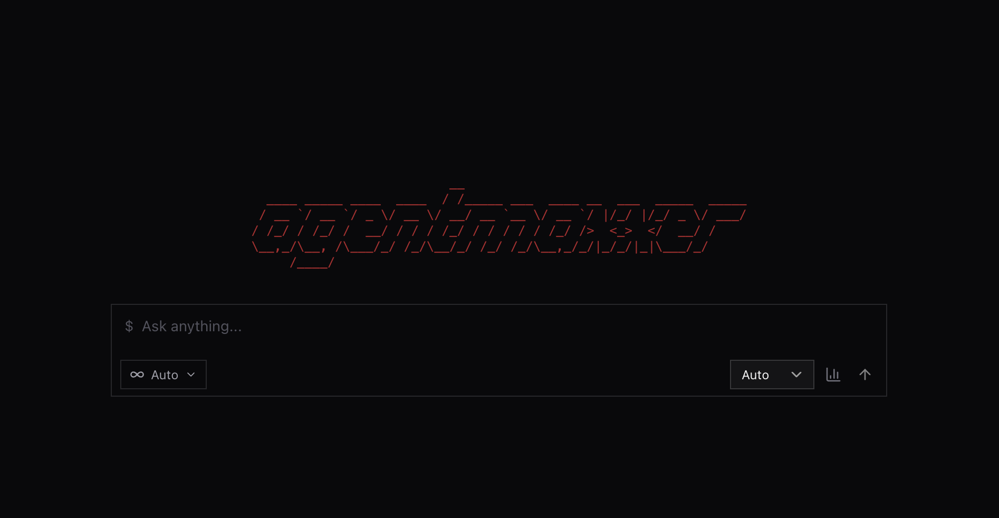

# AgentMaxxer

> Note: this is an experimental project.

AgentMaxxer is a gateway for coding agents. It discovers the agents installed on your machine (Claude Code, Codex CLI, Gemini CLI, Cursor CLI, OpenCode, and more), routes each task to an agent according to routing policy, and normalizes the agent's output into a single event stream, served over a CLI, WebSocket, and an OpenAI-compatible API.




## Features

- **Zero configuration.** No agent list to maintain. AgentMaxxer finds the CLIs already installed on your machine and checks their auth state at startup.
- **Routing.** `paid-first`, `free-first`, and `round-robin` modes. If an agent errors or hits a quota, the task tries the next one.
- **One event stream.** Every agent's stdout, tool calls, and reasoning come out as the same uniform stream.
- **Chat UI.** A Claude Code-style interface with streaming responses, tool-call cards, and a session sidebar.
- **Installed agents as an OpenAI API.** Every agent detected on your machine is exposed through `POST /v1/chat/completions`. Any tool that speaks the OpenAI protocol can drive Claude Code, Codex CLI, or whatever else is installed, no custom integration needed.
- **Usage tracking.** Per-agent health and usage recorded locally in SQLite.

## Install

Requires **Node.js >= 22** and **npm >= 11**.

```bash
npm install
npm run build
```

Start everything (API server, web UI, browser):

```bash
npm run amx -- start
```

The API serves on `http://localhost:4001` and the web UI on `http://localhost:4900`.

Or run them separately:

```bash
npm run amx -- serve   # API server only
npm run amx -- web     # web UI only
```

Missing an agent? Install it right from the CLI:

```bash
npm run amx -- install claude-code
```

## CLI

Any unrecognized first argument is treated as a task:

```bash
npm run amx -- run "explain how this repo is structured"
npm run amx -- agents   # list detected agents
npm run amx -- status   # agent health + today's usage
```

## API

The gateway exposes an OpenAI-compatible endpoint:

```bash
curl -N http://localhost:4001/v1/chat/completions \
  -H "Content-Type: application/json" \
  -d '{
    "model": "claude-code",
    "messages": [{"role": "user", "content": "Write a fibonacci function in Python"}],
    "stream": true
  }'
```

## Development

```bash
npm run dev         # watch all packages
npm run build       # build all packages
npm run test        # run all tests
npm run typecheck   # typecheck all packages
```

### Layout

| Path                 | Package                     | Purpose |
| -------------------- | --------------------------- | ------- |
| `apps/web`           | `@agentmaxxer/web`          | Web UI (React + Vite) |
| `apps/api`           | `@agentmaxxer/api`          | Fastify API server + WebSocket gateway |
| `apps/cli`           | `@agentmaxxer/cli`          | `amx` CLI |
| `apps/registry`      | `@agentmaxxer/registry-app` | Local provider-registry server |
| `packages/providers` | `@agentmaxxer/providers`    | Agent detection, adapters, output parsers |
| `packages/router`    | `@agentmaxxer/router`       | Routing, failover, quotas, execution engine |
| `packages/registry`  | `@agentmaxxer/registry`     | Provider-registry client + fallback data |
| `packages/tracking`  | `@agentmaxxer/tracking`     | SQLite usage, health, session stores |
| `packages/core`      | `@agentmaxxer/core`         | Message bus / shared core logic |
| `packages/schemas`   | `@agentmaxxer/schemas`      | Shared zod schemas |
| `packages/config`    | `@agentmaxxer/config`       | Configuration loading |
| `packages/types`     | `@agentmaxxer/types`        | Shared TypeScript types |

## Contributing

PRs are welcome. Keep it simple: `npm run typecheck` and `npm run test` must pass before submitting.

## License

MIT. See [LICENSE](./LICENSE).
